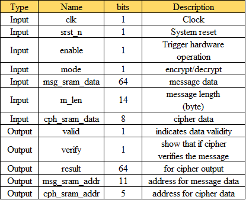
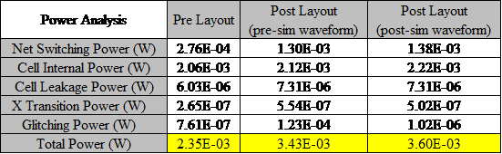

# How to use ?
### Prerequisite

# Innovations

# About Hardware
### Top Module View

  

### I/O Definition

### Layout View

 
### Power Analysis

### Area 

### Clock Period constrain

### Throughput analysis

# Referenced Work

