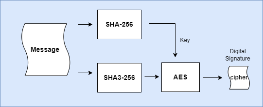
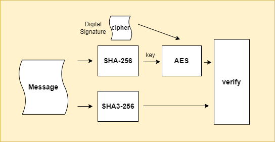
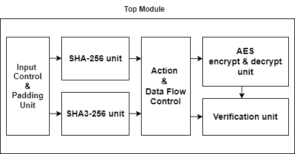
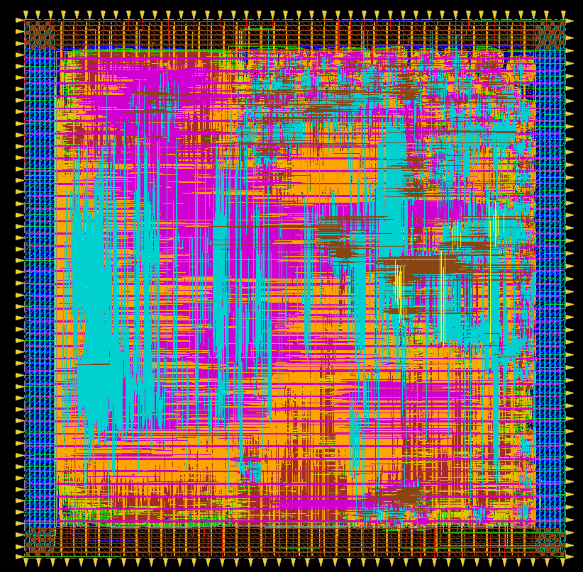

# How to use ?
### Prerequisite

# Design & Innovations
> Quote to be finished 

### Digital Signature Generation

  

### Verificate Authenticity

  

# About Hardware
### Top Module View

  

### Layout View

  

### I/O Definition

| Type   | Name          | bits | Description                                 |
| ------ | ------------- | ---- | ------------------------------------------- |
| Input  | clk           | 1    | Clock                                       |
| Input  | srst_n        | 1    | System reset                                |
| Input  | enable        | 1    | Trigger hardware operation               |
| Input  | mode          | 1    | encrypt/decrypt                             |
| Input  | msg_sram_data | 64   | message data                                |
| Input  | m_len         | 14   | message length (byte)                    |
| Input  | cph_sram_data | 8    | cipher data                                 |
| Output | valid         | 1    | indicates data validity                     |
| Output | verify        | 1    | show that if cipher verifies the message |
| Output | result        | 64   | for cipher output                           |
| Output | msg_sram_addr | 11   | address for message data                    |
| Output | cph_sram_addr | 5    | address for cipher data                     |

 
### Power Analysis

  
| Power Analysis          | Pre Layout | Post Layout (pre-sim waveform) | Post Layout (post-sim waveform) |
| ----------------------- | ---------- | --------------------------------- | ---------------------------------- |
| Net Switching Power (W) | 2.76E-04   | 1.30E-03                          | 1.38E-03                           |
| Cell Internal Power (W) | 2.06E-03   | 2.12E-03                          | 2.22E-03                           |
| Cell Leakage Power (W)  | 6.03E-06   | 7.31E-06                          | 7.31E-06                           |
| X Transition Power (W)  | 2.65E-07   | 5.54E-07                          | 5.02E-07                           |
| Glitching Power (W)     | 7.61E-07   | 1.23E-04                          | 1.02E-06                           |
| Total Power (W)         | 2.35E-03   | 3.43E-03                          | 3.60E-03                           |

### Area 

|                | area ( um2) | core utilization |
| -------------- | ---------------------- | ---------------- |
| synthesis area | 241509.46              | 100%             |
| APR area       | 284199.26              | 85%              |

### Clock Period constrain

|                  | timing (ns) |
| ---------------- | ----------- |
| synthesis timing | 2.35        |
| APR timing       | 3.2         |

# Referenced Work
<a id="1">[1]</a> 

<a id="1">[2]</a> 

# Referenced Paper
<a id="1">[1]</a> 
Secure Hash Standard. 
Federal Information Processing Standards Publication.
August 1 2002.

<a id="1">[2]</a> 
Penny Pritzker, Willie May., SHA-3 Standard:
Permutation-Based Hash and Extendable-Output
Functions., Federal Information Processing Standards
Publication. August 2015.

<a id="1">[3]</a> 
Advanced Encryption Standard., Federal Information
Processing Standards Publication., November 26, 2001.
